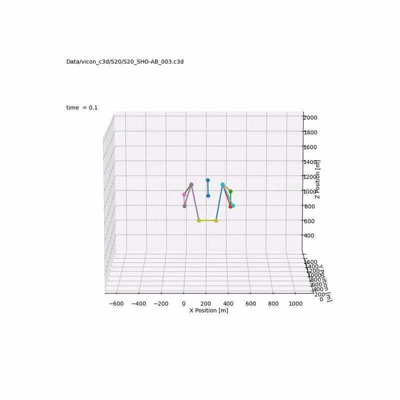

# ShoulderROM
PoseEstimation (SmartPhone), Vicon (Marker System), Theia (Markerless System) 각각에서 측정된 어꺠 관절 각도의 비교
 

본 내용
- Vicon의 마커로 Trunk와 Right Upper Arm 의 Transformation Matrix를 만들고 내적을 하여 관절각도를 계산
- Theia 에서 제공한 Transformation Matrix 데이터를 이용한 관절 각도 계산
- Vicon의 마커 데이터를 2D 상에서 계산
 

